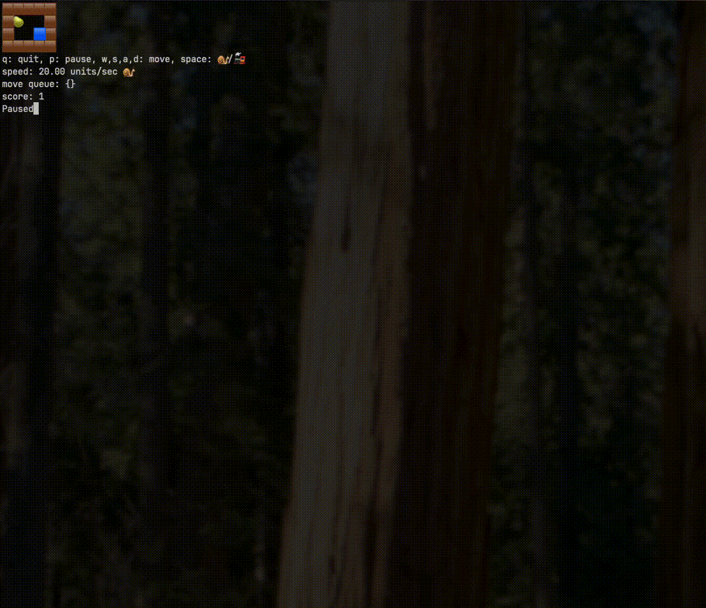

# Terminal Snake Game

A terminal-based Snake game written in Dart.

Demo:
Loose.

Win.


## Installation

### Global Installation (Recommended)

1. Make sure you have Dart installed on your system
2. Install the package globally:
```bash
   dart pub global activate terminal_snake
```
3. Run the game from anywhere:
```bash
   terminal_snake
```

### Local Development

1. Clone or download this repository
2. Navigate to the project directory
3. Run the game:
   ```bash
   dart run bin/terminal_snake.dart
   ```

## Controls

- `w` - Move up
- `s` - Move down
- `a` - Move left
- `d` - Move right
- `p` - Pause/Resume
- `space` - Boost toggle
- `q` - Quit

## Features

- Classic Snake gameplay
- Terminal-based graphics using ANSI escape codes
- Food collection and snake growth
- Collision detection with walls and self
- Pause functionality
- Move queue implemented
- Score tracking 